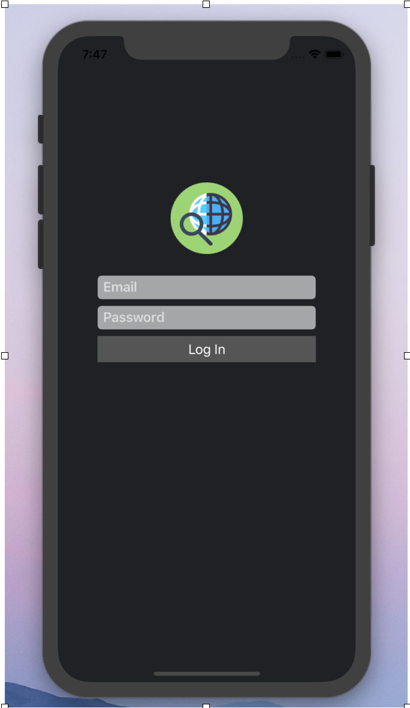
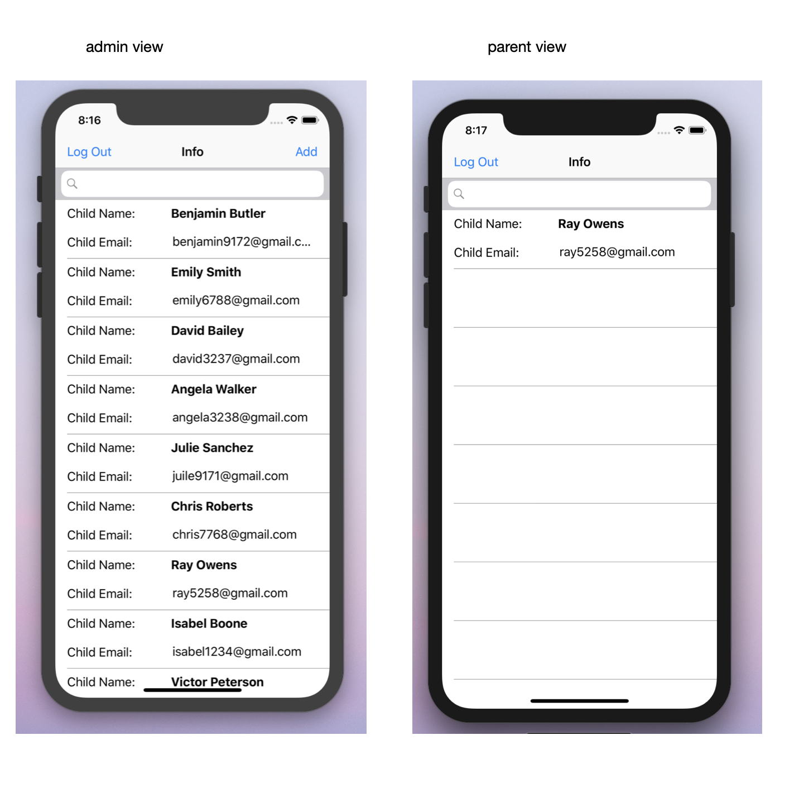
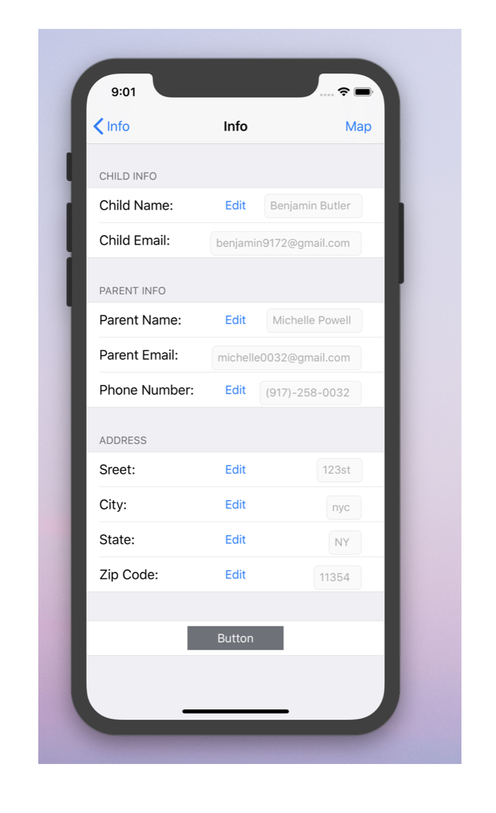
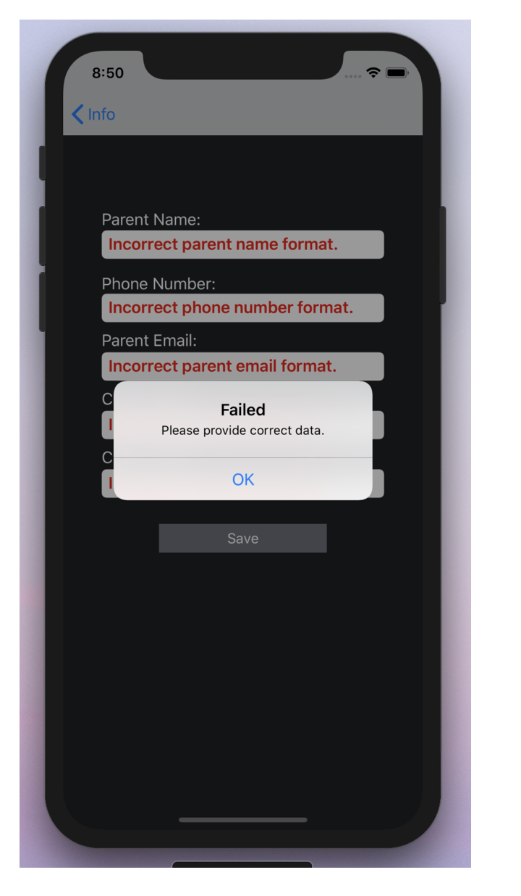
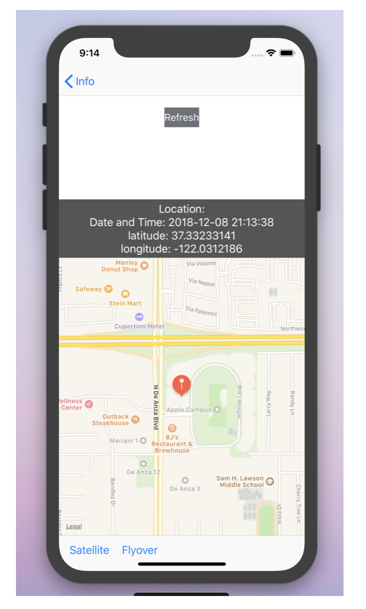

To run the project, must have newest version of Xcode. Make sure to open ChildrenTrackingSystem.xcworkspace. Upper top corner of xocde, you will see the play button. Before that, make sure pick a device for the test.

# ChildrenTrackingSystem
It is aimed for primarily focusing on tracking a child ‘s position and its location is sent to parent and control room. 

# User Login

# Log in Info

# Detail

# Add Info to firebase realtime database

# Map

